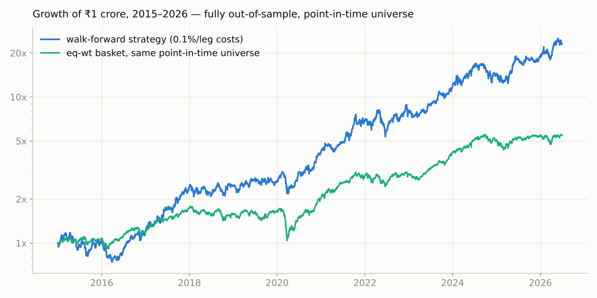

# Walk-Forward Strategy Lab — Indian Equities

A research program that asks one question honestly: **does automated
strategy search generalize out-of-sample — and how much of a typical
backtest's performance is manufactured by hindsight?**

Universe: NIFTY 100 + NIFTY Midcap 100 (NSE), reconstructed **as it stood
on every historical date**. Daily adjusted prices via Yahoo Finance,
2015–2026, transaction cost 0.1% per leg, fortnightly rebalance.



**₹1 crore → ₹23.19 crore in 11.5 years (31.5% CAGR, Sharpe 1.16), fully
out-of-sample, against ₹5.46 crore for an equal-weight basket of the same
point-in-time universe (15.9% CAGR).** Every number is independently
reproducible — see [Verification](#verification).

## 📊 The report

**[`walkforward_report.html`](walkforward_report.html)** is the centerpiece
of this repo: the full performance report generated from the actual run —
equity curves at two cost assumptions, half-yearly P&L tables, Sharpe /
drawdown / window statistics, the complete winner-per-window table, and
every cost and duty assumption stated explicitly.

GitHub doesn't render HTML inline, so either
[**open it via htmlpreview**](https://htmlpreview.github.io/?https://github.com/navneet-23/walkforward-strategy-lab/blob/main/walkforward_report.html)
or download the file and open it in a browser (it is fully self-contained).

## The system

Every 6 months, a staged tree search evaluates **~580 candidate
strategies** — 45 signals across 9 style families × 3 universe variants ×
portfolio sizes {4, 8} × a condition/gate tree of depth 2 — on the trailing
2 years, net of costs, and deploys the winner unchanged for the next
6 months. Every deployment window is therefore fully out-of-sample for the
strategy chosen in it. Meta-parameters (lookback, cadence, costs,
eligibility) were fixed a priori and never tuned. ~13,300 backtests total.

| Deep dive | File |
|---|---|
| Every signal, condition, gate and the search procedure | [`docs/STRATEGY_UNIVERSE.md`](docs/STRATEGY_UNIVERSE.md) |
| Which strategy traded in each 6-month window | [`docs/STRATEGY_TIMELINE.md`](docs/STRATEGY_TIMELINE.md) |
| Every stock held at every fortnightly rebalance | [`docs/HOLDINGS_TIMELINE.md`](docs/HOLDINGS_TIMELINE.md) (+ [CSV](docs/holdings_timeline.csv)) |
| The method, market-agnostic | [`docs/adaptive_walkforward_strategy.md`](docs/adaptive_walkforward_strategy.md) |

## The results ladder — each row removes one layer of hindsight

| Configuration | CAGR | Sharpe | Max DD |
|---|---|---|---|
| In-sample champion (test years seen at selection) | ~142% | 3.24 | −24.5% |
| Walk-forward, but on **today's** index members | 46.7% | 1.33 | −34.1% |
| **Walk-forward, point-in-time members (the honest run)** | **31.5%** | **1.16** | **−37.1%** |
| Eq-wt basket of the same point-in-time universe | 15.9% | — | — |

Selection bias (row 1 → 2) and survivorship bias (row 2 → 3) together
account for most of what a naive backtest would have claimed. What
survives both corrections: **~16 percentage points of annual alpha over
the universe's own drift**, 17 of 23 deployment windows positive, no
stable strategy identity — the winner rotates across style families with
the regime, and the rotation is the system.

## Point-in-time universe reconstruction

Historical index membership is rebuilt **event-by-event from NSE Indices'
own press-release archive**: 204 reconstitution announcements parsed into
769 inclusion/exclusion events (2012–2026), anchored on today's
constituent lists and walked backward (`scripts/pit_reconstruct.py`).
Symbol renames are mapped to surviving tickers; prices for demoted and
delisted members are re-downloaded. Residual limitation: 38 historical
members (skewed toward delisted failures) have no recoverable price
history, which biases *both* strategy and benchmark modestly upward.
The reconciliation against the earlier Wayback-snapshot method is in
[`verification/pit_events/`](verification/pit_events/).

## Verification

Nothing here needs to be taken on faith. [`verification/`](verification/)
is a frozen, checksummed package
([`README_VERIFICATION.md`](verification/README_VERIFICATION.md)) with
three independent levels:

1. **Recompute the claims** (seconds) — `python verify.py` recomputes
   CAGR, Sharpe, drawdown, window counts and the benchmark from the raw
   equity CSV with plain pandas. No project code.
2. **Replay the strategies** (minutes) — `python verify.py --replay`
   rebuilds the engine from the shipped price/membership data,
   re-executes all 23 logged winners with costs, and must land on the
   claimed final value of ₹231,892,331. It does, exactly.
3. **Rebuild from primary sources** (hours) — `pit_reconstruct.py --all`
   re-downloads and re-parses NSE's press releases, rebuilds membership,
   re-runs the full tournament. Reproduces approximately (Yahoo restates
   adjusted prices over time); levels 1–2 are exact.

## Repo layout

```
walkforward_report.html      ← the performance report (open in a browser)
docs/                        ← strategy universe, timelines, method
scripts/
  walkforward_study.py       ← the study: search + walk-forward, --mode pit|current|both
  pit_reconstruct.py         ← event-based PIT membership from NSE press releases
  make_report.py             ← regenerates the HTML report from the logs
  (older iterations kept for the record)
verification/                ← frozen package: code + data + claims + checksums
  verify.py                  ← the 2-level independent verifier
  data_pit_wf/               ← price, volume, membership parquets (shipped)
  dump_timelines.py          ← regenerates docs/ timelines from the logs
```

## Usage

```bash
pip install -r requirements.txt

# verify the published claims (fast, no downloads)
cd verification && python verify.py && python verify.py --replay

# re-run the full study from the shipped data (~1–2 h, 8 workers)
python scripts/walkforward_study.py --workers 8 --mode pit

# rebuild the point-in-time universe from NSE primary sources
python scripts/pit_reconstruct.py --all
```

## Assumptions and disclaimers

Fills at the close of each rebalance day; 0.1% per leg flat (the report
also re-prices everything at 0.05%/leg); no market impact beyond the
liquidity floor; dividends via Yahoo-adjusted prices. Research code and
research results, **not investment advice**. The in-sample and
current-universe rows are included deliberately as measured
counterfactuals — not as performance claims. Live performance of any
adaptive system should be expected to land below its walk-forward numbers.
